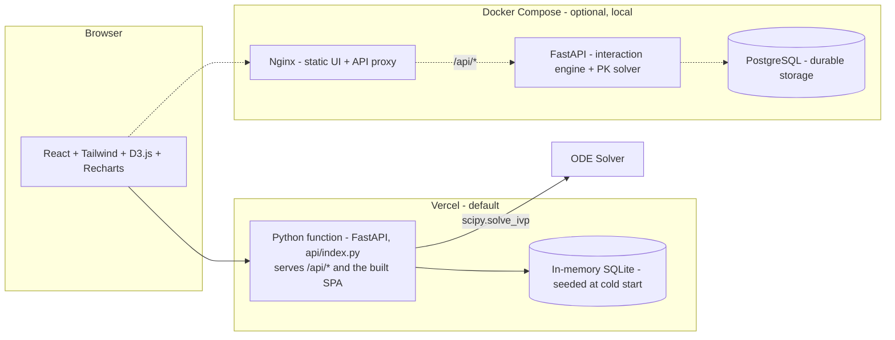

# NeuroTrace

> *A computational pharmacokinetic engine for psychiatric drug-drug interaction modeling*

**Psychiatric medication changes are blind decisions.** When a prescriber switches a patient from fluoxetine to venlafaxine, they know the transition matters, but they can't *see* what happens. Fluoxetine's active metabolite (norfluoxetine, half-life 4 to 16 days) lingers for weeks, silently inhibiting CYP2D6 and elevating co-prescribed drug levels long after the last pill. A patient stops smoking during an inpatient admission, and their clozapine levels double within days as CYP1A2 induction disappears, but no one rechecks the level until seizures start.

**NeuroTrace makes the invisible visible.**

It simulates multi-drug pharmacokinetic interactions in real time using a system of coupled nonlinear ordinary differential equations with Michaelis-Menten enzyme kinetics, dynamic enzyme pool modeling (synthesis, degradation, mechanism-based inhibition, and induction), competitive CYP450 inhibition, active metabolite tracking, and Bayesian parameter estimation. Built for psychiatric mental health nurse practitioners and psychiatrists managing complex medication regimens.

> **Disclaimer:** NeuroTrace is an **educational and research tool**. It does **not** constitute medical advice and should not be used as a sole basis for clinical decision-making. Always verify findings with current FDA labeling, clinical references, and independent clinical judgment.

> **Primary literature** backing every model (enzyme kinetics, mechanism-based inhibition, Hunter serotonin criteria, ACB scale, Beers criteria, CPIC phenotypes, D2 occupancy thresholds, Bayesian individualisation) is cited with DOIs in [REFERENCES.md](REFERENCES.md), mapped to the module that implements it.

> **Formal mathematical derivations** (definitions, theorems, proofs, and references underlying every model in NeuroTrace) live in [MATHEMATICAL_FOUNDATIONS.md](MATHEMATICAL_FOUNDATIONS.md). This README focuses on what NeuroTrace does and how to run it.

---

## What It Does

### 1. Interaction Engine
- Checks all pairwise drug-drug interactions in a psychiatric medication regimen (39 curated interactions plus dynamic CYP450-derived rules)
- Flags serotonin syndrome risk using **mechanism-diversity scoring**: an MAOI plus any reuptake inhibitor is Critical, not just "elevated risk"
- Quantifies QTc prolongation risk with **tiered agent classification** (high-risk: ziprasidone, methadone; moderate-risk: citalopram, haloperidol)
- Computes anticholinergic burden using the **validated ACB Scale** with age-adjusted Beers Criteria alerts
- Identifies CYP450 pathway conflicts (inhibitor plus substrate on the same enzyme) with dynamic severity adjustment for metabolizer phenotypes
- Generates regimen-level warnings: duplicate drug classes, MAOI contraindications, polypharmacy alerts, elderly-specific risks

### 2. Pharmacokinetic Simulator
- Solves a **coupled multi-drug ODE system** (state dimension 2N + M + P for N drugs, M metabolites, P enzyme pools) using `scipy.integrate.solve_ivp` with RK45
- Models **CYP450-mediated elimination** using Michaelis-Menten kinetics with **competitive inhibition**, where the degree of inhibition depends on the time-varying concentration of the inhibitor
- Tracks **dynamic enzyme pool levels** via synthesis/degradation/inactivation kinetics (Yang et al., 2008), enabling accurate modeling of mechanism-based inhibition and enzyme recovery after drug discontinuation
- Models **enzyme induction** (e.g., smoking on CYP1A2) as increased enzyme synthesis with gradual onset and offset following enzyme turnover half-life (Fahmi et al., 2008)
- Tracks **active metabolites** (norfluoxetine, paliperidone, desvenlafaxine) as separate compartments that contribute to enzyme inhibition
- Applies **pharmacogenomic adjustments** (CYP2D6/CYP2C19 metabolizer phenotypes following CPIC guidelines)
- Handles complex **dose event scheduling**: start, stop, dose changes, titration schedules, cross-tapers
- Generates **concentration-time curves** with therapeutic range bands, dose event markers, and enzyme activity sub-plots

### 3. Graph-Theoretic Analysis
- Models the drug interaction network as a **weighted multigraph** `G = (V, E, w)` and applies spectral graph theory
- Computes the **Laplacian spectrum** and **algebraic connectivity** λ₂ (Fiedler, 1973) to quantify regimen coupling, meaning how tightly drugs are interactionally connected
- The **Fiedler vector** partitions the regimen into interaction clusters and identifies **bridge drugs** whose removal maximally decouples the network
- The **spectral radius** ρ(W) and Perron eigenvector rank drugs by interaction centrality (Cvetković et al., 2010)
- Models the CYP450 drug-enzyme system as a **bipartite graph** `B = (V_D ∪ V_E, E_B)` with SVD-based metabolic pathway clustering
- Detects enzyme conflicts as length-2 paths and finds the **minimum vertex cover** (König, 1931), the smallest set of drug removals that eliminates all metabolic conflicts
- Models drug metabolism as a **flow network** and applies the **max-flow min-cut theorem** (Ford & Fulkerson, 1962) to identify metabolic bottleneck enzymes
- Evaluates **three-drug (hypergraph) interactions** and computes the **independence polynomial** `I(G, x) = Σ i_k x^k` for safe-subset enumeration
- Computes the **chromatic number** χ(G) for conflict graph partitioning and the **maximum independent set** α(G) for the largest safe drug subset

### 4. Advanced Mathematical Modeling
- **Monte Carlo simulation** of 10,000 virtual patients with population PK variability, producing confidence bands and toxicity probability estimates
- **Stochastic differential equations** (Milstein/Euler-Maruyama) for realistic "noisy" concentration curves capturing intra-individual variability
- **Optimal dose control** via discrete dynamic programming, computing mathematically optimal taper/titration schedules for cross-tapers and benzodiazepine discontinuation
- **Metabolic entropy**: a Shannon entropy-based CYP Diversification Index (CDI) that quantifies metabolic load concentration risk
- **Markov chain patient state model**: clinical trajectories (Stable → Relapse → Remission) with drug-modified transition probabilities and expected first passage times
- **Topological data analysis**: persistent homology detects interaction loops and structural patterns via Vietoris-Rips filtration
- **Game-theoretic enzyme competition**: models CYP450 competition as a congestion game, computes Price of Anarchy, and recommends drug substitutions to minimize metabolic inefficiency

### 5. Clinical Scenario Library
Pre-built scenarios demonstrating real prescribing dilemmas:
- **SSRI-to-SNRI cross-taper** with aripiprazole, showing norfluoxetine's lingering CYP2D6 inhibition
- **Clozapine plus smoking cessation**, where CYP1A2 deinduction causes clozapine levels to rise 35 to 50%
- **Lamotrigine plus valproic acid**, where slower titration is required to avoid Stevens-Johnson syndrome
- **CYP2D6 poor metabolizer on risperidone**, where risperidone accumulates and paliperidone drops
- **Polypharmacy cascade**, a 5-drug regimen with layered CYP and pharmacodynamic interactions

---

## Mathematical Foundations

NeuroTrace models multi-drug pharmacokinetic interactions using a system of coupled nonlinear ordinary differential equations with Michaelis-Menten enzyme kinetics, dynamic enzyme pool modeling, and Bayesian parameter estimation. The following equations describe the complete mathematical framework.

### 1. One-Compartment Oral Absorption Model (Bateman Function)

After a single oral dose D, plasma concentration over time (Gibaldi & Perrier, 1982):

```math
C(t) = \frac{F \cdot D \cdot k_a}{V_d(k_a - k_e)} \left( e^{-k_e t} - e^{-k_a t} \right)
```

where F is oral bioavailability, `ka` is the absorption rate constant (per hour), `ke` = `CL`/`Vd` is the elimination rate constant (per hour), and `Vd` is the apparent volume of distribution (L). The elimination half-life is:

```math
t_{1/2} = \frac{\ln 2}{k_e} = \frac{0.693 \cdot V_d}{\mathrm{CL}}
```

### 2. Multiple Dose Superposition at Steady State

For repeated oral dosing at interval τ hours, the steady-state peak and trough concentrations (Rowland & Tozer, 2011):

```math
C_{\mathrm{ss,max}} = \frac{F \cdot D \cdot k_a}{V_d(k_a - k_e)} \left( \frac{1}{1 - e^{-k_e \tau}} - \frac{1}{1 - e^{-k_a \tau}} \right)
```

```math
C_{\mathrm{ss,min}} = C_{\mathrm{ss,max}} \cdot e^{-k_e \cdot \tau}
```

Average steady-state concentration:

```math
\bar{C}_{\mathrm{ss}} = \frac{F \cdot D}{\mathrm{CL} \cdot \tau}
```

Time to reach steady state is approximately 4 to 5 half-lives.

### 3. Two-Compartment Model

For drugs with distribution phases (e.g., lithium, clozapine), the two-compartment model adds a peripheral compartment (Wagner, 1975):

```math
\frac{dA_1}{dt} = -k_{10}A_1 - k_{12}A_1 + k_{21}A_2 + R_{\mathrm{in}}(t)
```

```math
\frac{dA_2}{dt} = k_{12}A_1 - k_{21}A_2
```

where `A1` and `A2` are amounts in the central and peripheral compartments, `k10` is the elimination rate constant, and `k12` and `k21` are inter-compartmental transfer rate constants. The analytical solution after IV bolus gives biexponential decay:

```math
C(t) = A \cdot e^{-\alpha t} + B \cdot e^{-\beta t}
```

where α and β are the macro rate constants:

```math
\alpha, \beta = \frac{1}{2}\left[(k_{12} + k_{21} + k_{10}) \pm \sqrt{(k_{12} + k_{21} + k_{10})^2 - 4 k_{21} k_{10}}\right]
```

Implemented as an optional extension of `DrugConfig` in `backend/services/pk_simulator.py`: when `peripheral_vd_l`, `k12_per_h`, and `k21_per_h` are all supplied, the peripheral amount is appended to the ODE state vector and the central-plasma derivative gains the `-k12·A1 + k21·A2` exchange flux. The simulation result exposes these as `peripheral_concentrations` alongside the regular central-compartment curve; drugs without the extra parameters continue to use the one-compartment model unchanged.

### 4. Michaelis-Menten (Saturable) Elimination

When enzyme systems become saturated at therapeutic concentrations (Michaelis & Menten, 1913):

```math
\frac{dA}{dt} = R_{\mathrm{in}}(t) - \frac{V_{\mathrm{max}} \cdot C}{K_m + C}
```

At low concentrations, where C is far below `Km`, this approximates first-order kinetics with rate ≈ (`Vmax`/`Km`)·C. At high concentrations, where C is far above `Km`, elimination becomes zero-order with rate ≈ `Vmax`.

### 5. Competitive Inhibition of CYP450 Enzymes

**This is the core drug-drug interaction model.** When Drug B (inhibitor) competes with Drug A (substrate) for the same CYP enzyme (FDA DDI Guidance, 2020; ICH M12, 2024):

```math
v_A = \frac{V_{\mathrm{max},A} \cdot C_A}{K_{m,A}\left(1 + \displaystyle\frac{C_B}{K_{i,B}}\right) + C_A}
```

where `Ki,B` is the inhibition constant of Drug B, and a lower `Ki` means a stronger inhibitor. The critical insight is that **`CB` is not constant**: it changes over time as Drug B is absorbed, distributed, and eliminated, which makes the system a set of **coupled nonlinear ODEs**.

The FDA mechanistic static model predicts the AUC ratio:

```math
\text{AUC ratio} = \frac{1}{1 - f_m \left(1 - \displaystyle\frac{1}{1 + [I]_u / K_{i,u}}\right)}
```

where `fm` is the fraction metabolized by the affected enzyme, `[I]u` is the unbound inhibitor concentration, and `Ki,u` is the unbound inhibition constant.

### 6. Mechanism-Based (Time-Dependent) Inhibition

Some drugs irreversibly inactivate CYP enzymes (e.g., paroxetine on CYP2D6). The enzyme must be resynthesized (Mayhew et al., 2000; Yang et al., 2008):

```math
\frac{dE}{dt} = k_{\mathrm{synth}} - k_{\mathrm{deg}} \cdot E - \frac{k_{\mathrm{inact}} \cdot C_I}{K_I + C_I} \cdot E
```

where E is the active enzyme amount (normalized, baseline = 1.0), `k_synth` = `k_deg` at baseline, `k_deg` is the natural enzyme degradation rate constant, `k_inact` is the maximum inactivation rate constant, and `KI` is the inhibitor concentration at half-maximal inactivation.

After inhibitor removal, enzyme recovery follows first-order resynthesis:

```math
E(t) = E_{\mathrm{baseline}} \left(1 - e^{-k_{\mathrm{deg}} \cdot t}\right) + E_{\mathrm{inhibited}} \cdot e^{-k_{\mathrm{deg}} \cdot t}
```

**CYP enzyme degradation half-lives** (Yang et al., 2008):

| Enzyme | `k_deg` (per hour) | Degradation half-life (h) |
|--------|--------------------|---------------------------|
| CYP1A2 | 0.0077 | 90 |
| CYP2C9 | 0.0087 | 80 |
| CYP2C19 | 0.0077 | 90 |
| CYP2D6 | 0.0136 | 51 |
| CYP3A4 (hepatic) | 0.0193 | 36 |

This is why fluoxetine's CYP2D6 inhibition persists for weeks: even after norfluoxetine clears, the enzyme must be resynthesized, and the CYP2D6 degradation half-life is about 51 hours.

### 7. Enzyme Induction Kinetics

Enzyme inducers (e.g., carbamazepine, smoking/PAHs on CYP1A2) increase enzyme synthesis (Fahmi et al., 2008):

```math
\frac{dE}{dt} = k_{\mathrm{synth}} \cdot \left(1 + \frac{E_{\mathrm{max}} \cdot C_{\mathrm{inducer}}}{\mathrm{EC}_{50} + C_{\mathrm{inducer}}}\right) - k_{\mathrm{deg}} \cdot E
```

At new steady state:

```math
E_{\mathrm{ss,induced}} = E_{\mathrm{baseline}} \cdot \left(1 + \frac{E_{\mathrm{max}} \cdot C_{\mathrm{inducer,ss}}}{\mathrm{EC}_{50} + C_{\mathrm{inducer,ss}}}\right)
```

**Smoking cessation scenario:** When a smoker on clozapine quits, PAH-mediated CYP1A2 induction disappears. The enzyme level decays back to baseline with time constant 1/`k_deg`, and the CYP1A2 degradation half-life is about 90 hours. NeuroTrace models this dynamically: the enzyme pool gradually returns to baseline over roughly 2 to 3 weeks, during which clozapine levels rise 35 to 70%.

### 8. Net Effect Model (Simultaneous Inhibition and Induction)

The net fold-change in intrinsic clearance combines reversible inhibition (A), mechanism-based inhibition (B), and induction (C) (Fahmi et al., 2008):

```math
A = \frac{1}{1 + \displaystyle\frac{[I]_u}{K_{i,u}}} \quad \text{(reversible inhibition)}
```

```math
B = \frac{k_{\mathrm{deg}}}{k_{\mathrm{deg}} + \displaystyle\frac{k_{\mathrm{inact}} \cdot [I]_u}{K_{I,u} + [I]_u}} \quad \text{(mechanism-based inhibition)}
```

```math
C = 1 + \frac{d \cdot E_{\mathrm{max}} \cdot [I]_u}{\mathrm{EC}_{50,u} + [I]_u} \quad \text{(induction)}
```

The net fold-change in intrinsic clearance is the product A · B · C.

### 9. Multi-Drug Coupled ODE System

The complete system for N drugs sharing M enzymes, implemented in `pk_simulator.py` and solved by `scipy.integrate.solve_ivp` (Rostami-Hodjegan & Tucker, 2007). The state vector has dimension 2N + M + P: two compartments per drug, one per active metabolite, and one per tracked enzyme pool.

**Drug compartments:**

```math
\frac{dA_{\mathrm{gut},i}}{dt} = -k_{a,i} \cdot A_{\mathrm{gut},i} + \sum_{\mathrm{doses}} D_i \cdot F_i \cdot \delta(t - t_{\mathrm{dose}})
```

```math
\frac{dA_{\mathrm{plasma},i}}{dt} = k_{a,i} \cdot A_{\mathrm{gut},i} - \sum_{j=1}^{P} \frac{V_{\mathrm{max},ij} \cdot C_i \cdot (E_j / E_{j,0})}{K_{m,ij} \cdot \left(1 + \displaystyle\sum_{k \neq i}^{N} \frac{C_k}{K_{i,kj}}\right) + C_i} - \mathrm{CL}_{\mathrm{renal},i} \cdot C_i
```

**Dynamic enzyme pool:**

```math
\frac{dE_j}{dt} = k_{\mathrm{synth},j} \cdot \left(1 + \sum_{i=1}^{N} \frac{E_{\mathrm{max},ij} \cdot C_i}{\mathrm{EC}_{50,ij} + C_i}\right) - k_{\mathrm{deg},j} \cdot E_j - \sum_{i=1}^{N} \frac{k_{\mathrm{inact},ij} \cdot C_i}{K_{I,ij} + C_i} \cdot E_j
```

Here `Ci` = `A_plasma,i`/`Vd,i`, `Ej` is the normalized enzyme pool level (baseline = 1.0), `Vmax,ij` is the maximum metabolism rate of drug i via enzyme j, `Km,ij` is the Michaelis constant, `Ki,kj` is the competitive inhibition constant of drug k on enzyme j, `k_inact,ij` is the time-dependent inactivation rate, `Emax,ij` is the maximum induction fold, and the delta term is a Dirac delta for dose events.

### 10. Active Metabolite Tracking

For drugs with clinically relevant active metabolites (Altamura et al., 1994):

```math
\frac{dA_{\mathrm{norfluox}}}{dt} = f_{\mathrm{met}} \cdot \sum_{j} v_{\mathrm{fluox},j} - k_{e,\mathrm{norfluox}} \cdot A_{\mathrm{norfluox}}
```

Norfluoxetine is a potent CYP2D6 inhibitor, with `Ki` ≈ 17 nM. Its concentration feeds back into the inhibition term of the enzyme equation. Its half-life of roughly 4 to 16 days is much longer than fluoxetine's 1 to 4 days, which is why CYP2D6 inhibition persists for weeks after fluoxetine discontinuation.

### 11. Population PK: Nonlinear Mixed-Effects Model

For Bayesian estimation, individual PK parameters are drawn from population distributions (Sheiner & Beal, 1980; Mould & Upton, 2013):

```math
\theta_i = \theta_{\mathrm{pop}} \cdot e^{\eta_i}, \quad \eta_i \sim \mathcal{N}(0, \omega^2)
```

The Bayesian MAP estimation with therapeutic drug monitoring (TDM) data:

```math
\hat{\eta}_i = \arg\min_{\eta} \left[ \sum_{j} \frac{(C_{\mathrm{obs},ij} - C_{\mathrm{pred},ij}(\eta))^2}{\sigma^2} + \eta^T \Omega^{-1} \eta \right]
```

The first term is the likelihood (fit to observed data) and the second is the prior (population distribution). The posterior distribution is proportional to the likelihood times the prior.

Implemented in `backend/services/bayesian_pk.py` with log-normal population priors on log `CL` and log `Vd`, log-normal residual error, and a Bateman oral-superposition PK model. The MAP is found via BFGS, and posterior covariance is the inverse Hessian at the MAP (Laplace approximation). Exposed through `POST /api/advanced/bayesian-pk`, which also returns a 95% credible band for the predictive curve derived from 500 Monte-Carlo draws of the posterior.

### 12. Pharmacogenomic Clearance Adjustment

CYP2D6 genotype-guided dosing following CPIC guidelines (Caudle et al., 2020):

```math
\mathrm{CL}_{\mathrm{adj}} = \mathrm{CL}_{\mathrm{pop}} \cdot \left[\sum_j f_{m,j} \cdot \mathrm{AS}_j + \left(1 - \sum_j f_{m,j}\right)\right]
```

where `fm,j` is the fraction metabolized by enzyme j and `AS_j` is the Activity Score for enzyme j based on genotype.

| Phenotype | Activity Score | AS multiplier |
|-----------|---------------|-----------------|
| Poor Metabolizer (PM) | 0 | 0.0 to 0.1 |
| Intermediate Metabolizer (IM) | 0.25 to 1.0 | 0.25 to 0.5 |
| Normal Metabolizer (NM) | 1.0 to 2.0 | 1.0 |
| Ultra-Rapid Metabolizer (UM) | above 2.0 | 1.5 to 3.0 |

**Example:** Aripiprazole is metabolized 65% by CYP3A4 and 35% by CYP2D6. A CYP2D6 poor metabolizer has effective clearance = CL × (0.65 × 1.0 + 0.35 × 0.3) = 0.755 × CL, yielding roughly 33% higher steady-state levels.

### 13. PBPK Liver Compartment (Well-Stirred Model)

The well-stirred liver model for hepatic clearance (Rowland et al., 1973; Ito & Houston, 2005):

```math
\mathrm{CL}_h = \frac{Q_h \cdot f_u \cdot \mathrm{CL}_{\mathrm{int}}}{Q_h + f_u \cdot \mathrm{CL}_{\mathrm{int}}}
```

where `Qh` is hepatic blood flow (about 1.35 L/min), `fu` is the fraction unbound in plasma, and `CLint` is the intrinsic clearance under linear conditions, summed as `Vmax,j`/`Km,j` over enzymes. Under competitive inhibition `CLint` becomes

```math
\mathrm{CL}_{\mathrm{int}}(I) = \sum_j \frac{V_{\mathrm{max},j}/K_{m,j}}{1 + I_u / K_{i,j}}
```

yielding extraction ratio `Eh` = `CLh`/`Qh` and first-pass fraction `Fh` = 1 − `Eh`. The Rowland/Wilkinson classification is low (`Eh` below 0.3), intermediate (`Eh` from 0.3 up to 0.7), or high (`Eh` at or above 0.7).

Implemented in `backend/services/hepatic_extraction.py` and exposed through `POST /api/advanced/hepatic-extraction`. It pulls `Vmax`, `Km`, and inhibitor `Ki` directly from the CYP450 profile database and layers on DDI effects using steady-state plasma concentrations from the PK simulator.

### 14. Tissue Distribution (Reaction-Diffusion)

For drugs with slow tissue penetration (e.g., lithium into CNS), a PDE-based approach (de Lange, 2013):

```math
\frac{\partial C(x,t)}{\partial t} = D \cdot \frac{\partial^2 C(x,t)}{\partial x^2} - k_e \cdot C(x,t) + S(x,t)
```

Blood-brain barrier flux, a Robin boundary condition at x = 0:

```math
-D \cdot \left.\frac{\partial C}{\partial x}\right|_{x=0} = P_{\mathrm{eff}} \cdot (f_u \cdot C_{\mathrm{plasma}}(t) - C(0, t)), \quad \left.\frac{\partial C}{\partial x}\right|_{x=L} = 0
```

This explains the 2 to 4 week lag between starting an SSRI and clinical effect: the drug must equilibrate across the BBB, and then downstream neuroadaptive changes (receptor downregulation) must occur.

Implemented in `backend/services/tissue_pde.py` via the method of lines. The spatial operator is discretized on a uniform 1-D grid with central finite differences, and the resulting stiff ODE system is integrated with LSODA. Per-drug defaults for `Peff` and `fu` cover SSRIs/SNRIs, antipsychotics, mood stabilizers, and benzodiazepines. Exposed through `POST /api/advanced/tissue-pde`, driven by the PK simulator output.

### 15. Receptor Occupancy Model (PD Link)

Connecting PK (drug levels) to PD (clinical effect) via the `Emax` model (Meyer et al., 2004):

```math
E(C) = E_0 + \frac{E_{\mathrm{max}} \cdot C^{\gamma}}{\mathrm{EC}_{50}^{\gamma} + C^{\gamma}}
```

Serotonin transporter (SERT) occupancy by SSRIs, as a percentage:

```math
\text{SERT occupancy} = \frac{C_{\mathrm{plasma}}}{C_{\mathrm{plasma}} + K_d} \times 100
```

Published `Kd` values: fluoxetine ≈ 0.8 nM, sertraline ≈ 0.3 nM, paroxetine ≈ 0.1 nM. Clinical response typically requires SERT occupancy above 80%.

Implemented in `backend/services/receptor_occupancy.py` with built-in `Kd` profiles for about 25 psychiatric drugs across SERT, NET, DAT, D2, 5-HT2A, 5-HT1A, H1, M1, and α-adrenergic targets. Occupancy trajectories are auto-classified against clinical windows: SERT at or above 80% is therapeutic, D2 between 60% and 80% is therapeutic, and D2 above 80% carries EPS risk. Exposed through `POST /api/advanced/receptor-occupancy`.

---

## Graph-Theoretic Foundations

NeuroTrace models the structural problem of drug interactions (which drugs interact with which, through which enzymes, creating which risk cascades) as a formal graph theory problem. This connects algebraic graph theory directly to clinical pharmacology.

### Weighted Interaction Multigraph

The drug interaction network is defined as a weighted undirected multigraph:

```math
G = (V, E, w, \ell)
```

Here V is the set of medications (vertices), E is the set of interacting pairs (edges), w maps each edge to a severity in {1, 2, 3, 4} (Minor = 1, Moderate = 2, Major = 3, Critical = 4), and ℓ encodes mechanism type as a subset of {PK, PD}. The weighted adjacency matrix W is:

```math
W_{ij} = \begin{cases}
w(d_i, d_j) & \text{if } (d_i, d_j) \in E \\
0 & \text{otherwise}
\end{cases}
```

### Spectral Risk Analysis

The graph Laplacian L = D − W, where D is the diagonal degree matrix, has eigenvalues 0 = λ₁ ≤ λ₂ ≤ ... ≤ λₙ.

The **algebraic connectivity** λ₂ (Fiedler value) measures how tightly coupled the interaction network is. The corresponding **Fiedler vector** partitions the drug set into two interaction clusters by sign:

```math
\mathbf{L}\mathbf{v}_2 = \lambda_2 \mathbf{v}_2
```

The drug closest to zero in the Fiedler vector is the **bridge drug**, the node whose removal maximally decouples the network (Fiedler, 1973).

The **spectral radius** ρ(W), the largest eigenvalue of W, bounds the maximum cascading interaction intensity. By the Perron-Frobenius theorem, the corresponding eigenvector has all non-negative entries, identifying the most interactionally central drug (Cvetković et al., 2010).

### Bipartite CYP450 Drug-Enzyme Network

The CYP450 metabolism system forms a bipartite graph with drugs on one side and enzymes on the other. The biadjacency matrix M encodes substrate fractions, inhibitor potencies, and inducer effects. Its singular value decomposition clusters drugs by metabolic pathway similarity.

Enzyme conflicts are counted as length-2 paths through each enzyme node:

```math
\mathrm{Conflicts}(G) = \sum_{j=1}^{m} |V_{\mathrm{substrate}}(e_j)| \cdot |V_{\mathrm{inhibitor}}(e_j)|
```

The **minimum vertex cover** (König, 1931) identifies the smallest set of drug removals that eliminates all metabolic conflicts, since maximum matching equals minimum vertex cover in a bipartite graph.

### Metabolic Flow Network

Drug metabolism through CYP450 enzymes is modeled as a capacitated flow network with enzyme capacities given by `Vmax,ij`. The **max-flow min-cut theorem** (Ford & Fulkerson, 1962) identifies the metabolic bottleneck:

```math
\text{max flow} = \text{min cut}
```

### Polypharmacy Combinatorics

For n concurrent medications, there are n-choose-2 pairwise and n-choose-3 triple interactions to evaluate. The **independence polynomial** enumerates safe drug combinations of each size:

```math
I(G, x) = \sum_{k=0}^{\alpha(G)} i_k \cdot x^k
```

where `i_k` is the number of independent sets of size k in the conflict graph. The **chromatic number** χ(G) gives the minimum number of compatibility phases for safe sequential administration. The **maximum independent set** α(G) identifies the largest subset of drugs that can be taken together without major interactions.

By Ramsey's theorem, R(3,3) = 6: in any regimen of 6 or more drugs, there must exist either 3 mutually interacting drugs or 3 mutually safe drugs (Ramsey, 1930).

---

## Advanced Mathematical Modeling

NeuroTrace extends beyond deterministic simulation with a suite of advanced mathematical methods spanning stochastic analysis, optimal control, information theory, algebraic topology, and algorithmic game theory.

### Stochastic Pharmacokinetics

#### Monte Carlo Population Simulation

PK parameters are drawn from log-normal population distributions and the ODE system is solved for K virtual patients (Nestorov, 2007):

```math
\theta_i = \theta_{\mathrm{pop}} \cdot e^{\eta_i}, \quad \eta_i \sim \mathcal{N}(0, \omega^2)
```

Toxicity probability at each time point:

```math
P(\text{toxic at } t) = \frac{1}{K}\sum_{k=1}^{K} \mathbb{1}\left[C^{(k)}(t) > C_{\mathrm{toxic}}\right]
```

CYP2D6 polymorphism is modeled as a mixture distribution reflecting Caucasian population frequencies: poor metabolizer about 7%, intermediate about 15%, normal about 70%, ultra-rapid about 8%.

#### Itô SDE Pharmacokinetics

Deterministic ODEs are replaced with stochastic differential equations capturing intra-individual variability (Kloeden & Platen, 1992; Donnet & Samson, 2013):

```math
dC_i = \mu_i(C, t)\,dt + \sigma_i \cdot C_i \cdot dW_i(t)
```

Solved numerically via the Milstein method:

```math
C_i(t+\Delta t) = C_i(t) + \mu_i \Delta t + \sigma_i C_i \sqrt{\Delta t}\, Z + \tfrac{1}{2}\sigma_i^2 C_i \Delta t (Z^2 - 1)
```

The geometric Brownian motion structure ensures concentrations remain non-negative.

### Optimal Dose Control

Given a clinical transition (e.g., SSRI-to-SNRI cross-taper), the optimizer minimizes a cost functional via discrete dynamic programming (Bellman, 1957; Pontryagin et al., 1962):

```math
J[\mathbf{u}] = \sum_{t=0}^{T} \left[ \alpha \max(0, C - C_{\mathrm{max}})^2 + \beta \max(0, C_{\mathrm{min}} - C)^2 + \delta |\Delta D| \right]
```

subject to available tablet sizes and clinical constraints (washout periods, max daily reduction, Ashton taper rates for benzodiazepines). The optimizer produces a day-by-day dose schedule with human-readable recommendations.

### Information-Theoretic Metabolic Entropy

The CYP Diversification Index (CDI) quantifies how evenly the metabolic load is distributed across enzymes using Shannon entropy (Shannon, 1948):

```math
\mathrm{CDI} = \frac{H(\mathbf{p})}{\log_2 M}, \quad H(\mathbf{p}) = -\sum_{j=1}^{M} p_j \log_2 p_j
```

where `p_j` is the normalized metabolic load on enzyme j. A CDI of 1.0 indicates perfectly diversified metabolism and the lowest bottleneck risk; a CDI near 0 indicates dangerous concentration on a single enzyme.

Kullback-Leibler divergence from the uniform distribution quantifies deviation from the ideal:

```math
D_{\mathrm{KL}}(\mathbf{p} \,\|\, \mathbf{u}) = \sum_j p_j \log_2 \frac{p_j}{1/M}
```

### Markov Chain Patient State Model

The patient's clinical trajectory is modeled as a discrete-time Markov chain (Norris, 1997) with states Stable, Partial Response, Relapse, Adverse Event, Hospitalized, and Remission.

The stationary distribution gives the long-run fraction of time in each clinical state. Expected first passage times solve:

```math
m_{ij} = 1 + \sum_{k \ne j} P_{ik} \cdot m_{kj}
```

Drug class effects modify transition probabilities: SSRIs increase transitions toward Remission, antipsychotics reduce Relapse probability, and all medications carry some adverse event risk.

### Topological Data Analysis: Persistent Homology

Persistent homology detects topological features in the drug interaction network (Edelsbrunner & Harer, 2010; Carlsson, 2009). The Vietoris-Rips complex is built from a distance matrix where distance is the reciprocal of interaction severity:

```math
\mathrm{VR}_\epsilon = \{\sigma \subseteq V : d(v_i, v_j) \leq \epsilon \text{ for all } v_i, v_j \in \sigma\}
```

Betti numbers track connected components (β₀) and interaction loops (β₁) as the filtration parameter increases. Persistent β₁ cycles reveal metabolic feedback loops, such as A inhibiting B's enzyme, B inhibiting C's enzyme, and C inducing A's enzyme.

### Algorithmic Game Theory: Enzyme Competition

Drug competition for CYP450 capacity is modeled as an N-player congestion game (Roughgarden, 2016; Rosenthal, 1973). The social cost quantifies total metabolic inefficiency:

```math
\mathrm{SC}(\mathbf{C}) = \sum_i \left(\frac{\mathrm{CL}_{i,\mathrm{ideal}}}{\mathrm{CL}_{i,\mathrm{eff}}} - 1\right)^2
```

The Price of Anarchy (PoA) measures how much worse the competitive outcome is compared to the cooperative optimum. A drug substitution recommender identifies replacements that minimize social cost, for example replacing fluoxetine (a strong CYP2D6 inhibitor) with sertraline (minimal CYP2D6 impact) when aripiprazole is co-prescribed.

---

## Clinical Scenario: SSRI-to-SNRI Cross-Taper

**Patient:** 34F on fluoxetine 40 mg plus aripiprazole 10 mg for 8 weeks with partial response. Clinician decides to cross-taper to venlafaxine XR.

**The problem:** Fluoxetine's metabolite (norfluoxetine, half-life 4 to 16 days) continues inhibiting CYP2D6 for weeks after discontinuation. During this window, aripiprazole levels remain elevated, increasing risk of akathisia and EPS. Premature venlafaxine initiation while fluoxetine levels remain significant creates serotonin toxicity risk.

**NeuroTrace shows:** The concentration-time plot displays fluoxetine decay, norfluoxetine persistence, and aripiprazole elevation over 8 weeks. The enzyme activity sub-plot, now driven by the dynamic enzyme pool model, shows CYP2D6 activity recovering gradually over a degradation half-life of about 51 hours as norfluoxetine clears and the enzyme is resynthesized.

**Clinical insight:** Safe to start venlafaxine approximately 5 weeks after last fluoxetine dose. Aripiprazole dose should remain reduced until norfluoxetine has cleared and the CYP2D6 pool has recovered.

---

## Clinical Scenario: Clozapine and Smoking Cessation

**Patient:** 45M with treatment-resistant schizophrenia, stable on clozapine 400 mg/day (levels 420 ng/mL). Smokes 20 cigarettes/day. Admitted to inpatient unit where smoking is prohibited.

**The problem:** Smoking induces CYP1A2 (via polycyclic aromatic hydrocarbons), which metabolizes roughly 70% of clozapine. NeuroTrace models this as dynamic enzyme induction: the CYP1A2 enzyme pool is elevated to about 1.5× baseline during active smoking. Upon cessation, the enzyme pool decays back to baseline over a degradation half-life of about 90 hours (CYP1A2 turnover). Over 2 to 4 weeks, clozapine clearance drops by roughly 35%, and levels can rise 50 to 70%, potentially reaching the toxic range above 1000 ng/mL, where seizures and myocarditis become concerns.

**NeuroTrace shows:** Simulating with `smoking=True` (baseline) against `smoking=False` (post-cessation) demonstrates the predicted rise in clozapine concentrations and the need for a proactive 25 to 33% dose reduction.

---

## Architecture



The two deployments run the same application code. The only difference is
`DATABASE_URL`: unset, the API builds an in-memory SQLite database and seeds it
from `seed_data.py` at startup; set to a Postgres URL, it uses that instead.
The reference data is static, so nothing is lost by rebuilding it per cold
start.

- **Frontend:** React 18 (TypeScript), Tailwind CSS, **D3.js** (force-directed interaction graph plus concentration-time curves), **Recharts** (risk summary charts)
- **Backend:** Python **FastAPI**, SQLAlchemy ORM, **NumPy + SciPy** (`solve_ivp` for ODE integration with dynamic enzyme pools)
- **Database:** SQLite in-memory by default, PostgreSQL when `DATABASE_URL` is set. Curated seed data: 50 psychiatric medications with published PK parameters, 78 CYP450 enzyme profiles with Ki/Km/Vmax values, 39 interaction rules, 5 clinical scenarios

---

## Data Sources

- **PK parameters** (F, `Vd`, `CL`, `ka`, half-life): FDA-approved prescribing information (package inserts)
- **Therapeutic ranges**: AGNP Consensus Guidelines for TDM in Neuropsychopharmacology (Hiemke et al., 2018)
- **CYP450 profiles** (`Ki`, `Km`, `Vmax`, `fm`): in vitro enzyme kinetic studies from FDA labels and Stahl's Essential Psychopharmacology (5th ed.)
- **Enzyme degradation half-lives** (`k_deg`): Yang et al., 2008
- **Interaction rules**: FDA drug safety communications, Stahl's, published case reports
- **Anticholinergic scores**: Anticholinergic Cognitive Burden (ACB) Scale (Boustani et al., 2008)
- **Beers Criteria**: American Geriatrics Society 2023 Updated AGS Beers Criteria
- **Pharmacogenomics**: CPIC Guidelines (Caudle et al., 2020; Hicks et al., 2015)

Each parameter is annotated with its source in the seed data files (`backend/database/seed_data.py`).

**Coverage boundary.** 50 of the 115 medications carry full PK parameters (`CL`, `Vd`, `ka`); the remaining 65 have interaction, CYP450 and half-life data only. Those entries are complete for the interaction and risk analyses, which is what they are used for, but cannot drive the compartmental model. Half-life = ln 2 · `Vd`/`CL` is one equation in two unknowns, and `ka` additionally needs `tmax`, so the missing parameters are not recoverable from what is present. Rather than invent values, `/api/medications/pk-complete` reports which medications support the PK-model analyses, the search response carries a `has_pk_parameters` flag, and the Design and Diagnostics panels select a usable medication themselves.

---

## Deploying to Vercel

The repository is configured for Vercel out of the box and needs no database,
no environment variables, and no external services.

```bash
vercel deploy
```

Vercel assigns each deployment a URL that embeds the account or team slug and
the branch name. Those are unstable and identify the deploying account, so the
canonical production domain is used here instead. Substitute your own domain
when self-hosting.

| Service | Path |
|---------|------|
| App | `/` |
| API (Swagger) | `/docs` |
| API (ReDoc) | `/redoc` |
| Deploy health check | `/api/__status` |

Live deployment: <https://psych-medic-interaction-checker.vercel.app/>

`vercel.json` wires it up:

- `frontend/` is built with Vite into `frontend/dist`
- `api/index.py` exposes the FastAPI app, which serves **both** the API and the
  built SPA. `includeFiles` puts `backend/` and `frontend/dist/` in the
  function bundle.
- There are **no rewrites**. Vercel detects this as a FastAPI backend project
  and routes every request to the application, so a rewrite pointing at
  `/index.html` is handed straight back to FastAPI and 404s. Instead the app
  mounts `/assets` and falls back to `index.html` for any non-API path, which
  is what makes client-side routes deep-link correctly.

Two design changes make the API work on serverless, where a request cannot rely
on state written by a previous one:

- `POST /api/simulation/run` configures and runs a simulation in a single
  request. The older `POST /api/simulation/create` plus
  `GET /api/simulation/{id}/run` pair is still available for deployments backed
  by a real database.
- The analysis endpoints (`tissue-pde`, `receptor-occupancy`,
  `hepatic-extraction`) accept an inline `simulation` object as well as a
  `simulation_id`.

### Deployment self-check

`GET /api/__status` reports whether seeding succeeded, the Python version, and
the number of registered routes. It is the fastest way to confirm a deploy is
healthy.

> **Exposure note.** On a public deployment this endpoint discloses the Python
> runtime version and route count, and `/docs` and `/redoc` publish the full API
> surface. That is intentional for an open educational project, but if you
> deploy your own instance for anything less open, gate `/api/__status` behind a
> token and disable the interactive docs by passing `docs_url=None,
> redoc_url=None` to `FastAPI()`. Nothing here returns patient data: the API is
> stateless by default and the seeded database holds only published reference
> pharmacology.

### Keep the `app` binding at the top level

Vercel detects this project as a FastAPI backend and statically scans
`api/index.py` for a module-level `app`. `from main import app` must stay
unconditional at the top level. Wrapping it in `try`/`except` hides it from
that scan and fails the build with *"Found api/index.py but it does not define
a top-level `app` FastAPI instance"*.

### Troubleshooting a crashed function

If `/api/*` returns 500, check `vercel logs`, where the Python runtime prints
the full import traceback.

Do **not** override `installCommand` in `vercel.json`. Doing so suppresses the
`pip install -r requirements.txt` step for the whole project, and the function
then fails with `ModuleNotFoundError: No module named 'sqlalchemy'`. A copy of
the requirements lives at `api/requirements.txt` as well, because
`@vercel/python` resolves a requirements file next to the entrypoint before
falling back to the project root.

To use durable storage instead, set `DATABASE_URL` to a Postgres connection
string (Neon, Supabase, Vercel Postgres) in the project's environment
variables. Nothing else changes.

Optional environment variables:

| Variable | Default | Purpose |
|----------|---------|---------|
| `DATABASE_URL` | `sqlite://` (in-memory) | Postgres URL for durable storage |
| `CORS_ORIGINS` | localhost dev origins | Comma-separated allowed browser origins. Not needed on Vercel, where the SPA and API share an origin |

---

## Quick Start

### Docker Compose (optional, for local Postgres)

```bash
cd neurotrace
docker compose up --build
```

| Service | URL |
|---------|-----|
| Frontend | http://localhost:5173 |
| API (Swagger) | http://localhost:8000/docs |
| PostgreSQL | 127.0.0.1:5433 (user: `neurotrace`, db: `neurotrace`) |

All three ports bind to `127.0.0.1` rather than `0.0.0.0`, so nothing is exposed
to the local network. The development database password defaults to a
placeholder; override `POSTGRES_USER`, `POSTGRES_PASSWORD` and `POSTGRES_DB` in
a `.env` file (already gitignored) if you want something else. These are local
development credentials only and are not used by the Vercel deployment, which
runs on in-memory SQLite unless `DATABASE_URL` is set.

Docker Compose keeps the three-service split, with Nginx serving the SPA and
Postgres for durable storage. The Vercel deployment differs: there the single
FastAPI application serves both the API and the built SPA (see below).

The database is automatically seeded on first API startup with 50 medications, 78 CYP450 profiles, 39 interactions, and 5 clinical scenarios.

### Local Development

**Backend:**
```bash
cd backend
pip install -r requirements.txt
uvicorn main:app --reload
```

**Frontend:**
```bash
cd frontend
npm install
npm run dev
```

Vite proxies `/api` to `http://127.0.0.1:8000`.

---

## Testing

```bash
cd backend
pip install pytest numpy scipy
pytest -v
```

**295 tests** covering:

- **`test_enzyme_kinetics.py`**: Michaelis-Menten rate at `Km` (equal to `Vmax`/2), competitive inhibition math, enzyme activity factors
- **`test_risk_calculator.py`**: mechanism-aware serotonin syndrome scoring (MAOI plus SSRI is Critical), tiered QTc risk, anticholinergic burden, CNS depression
- **`test_pk_simulator.py`**: dose scheduler event generation, steady-state convergence, **CYP2D6 inhibition effect** (fluoxetine increases aripiprazole AUC by at least 1.3×, matching FDA label), **norfluoxetine persistence** after fluoxetine discontinuation, **smoking cessation** effect on clozapine levels (at least a 1.2× increase via the dynamic CYP1A2 enzyme pool), and **enzyme pool dynamics** (unit tests for `enzyme_pool_derivative`, integration tests for MBI-mediated enzyme depletion and post-discontinuation recovery with a CYP2D6 degradation half-life of about 51 h)
- **`test_graph_analysis.py`**: spectral graph theory (λ₁ = 0 and λ₂ > 0 for connected graphs, `ρ(Kn) = w(n-1)`), chromatic number (`χ(K4) = 4`), independence polynomial (`I(Kn, x) = 1 + nx` for conflict graphs), Fiedler vector partition for disconnected clusters, **bipartite conflict detection** (substrate × inhibitor counting), **König minimum cover**, **max-flow/min-cut** bottleneck identification, **three-drug interaction detection** (lithium plus NSAID plus ACE inhibitor triple whammy), and **Ramsey R(3,3) = 6** verification on 6-drug regimens
- **`test_optimal_design.py`**, **`test_sensitivity_analysis.py`**, **`test_treatment_mdp.py`**, **`test_identifiability.py`**: the design and diagnostics layer, validated against cases with known answers rather than by inspection. Sobol indices are checked against the analytic Ishigami decomposition and against `AUC = F·D/CL`; Fisher information is checked for additivity, singularity when under-sampled, and dose-invariance under proportional error; the MDP value function is checked against the Bellman optimality equation with policy iteration and value iteration cross-checked; identifiability is checked against schedules whose rank is known by construction
- **`test_stateless_api.py`**: the database-free deployment path. The schema builds on SQLite, reference data seeds itself, brand-name search works without PostgreSQL array functions, the one-shot `POST /api/simulation/run` needs no prior request, analysis endpoints accept an inline simulation, and the stateless and persisted paths produce identical concentration curves
- **`test_advanced_math.py`** (40 tests): **Monte Carlo** (CI ordering, toxicity probability, parameter perturbation), **optimal control** (taper schedules, titration, dose-level constraints, risk timelines), **SDE simulation** (Milstein against Euler-Maruyama, non-negativity, stochastic path variability, determinism at σ = 0), **entropy analysis** (CDI near 0 for single-enzyme concentration, CDI near 1 for uniform distribution, KL divergence), **Markov chain** (stochastic matrix validation, stationary distribution, treatment effect on Remission probability, first passage times), **TDA** (persistent homology, β₀ component counting, β₁ loop detection, distance ordering), and **game theory** (ideal against effective clearances, social cost, Price of Anarchy at or above 1, no-competition baseline)

---

## API Surface

| Method | Path | Description |
|--------|------|-------------|
| `GET` | `/api/medications/search?q=` | Autocomplete search |
| `GET` | `/api/medications/{id}` | Full medication profile plus CYP450 |
| `GET` | `/api/medications/{id}/pk-parameters` | PK parameters only |
| `GET` | `/api/medications/classes` | Distinct drug classes |
| `GET` | `/api/medications/pk-complete` | Medications whose entry can drive the compartmental model |
| `POST` | `/api/interactions/check` | Pairwise interactions for IDs |
| `GET` | `/api/cyp450/profile?medication_ids=1,2,3` | Enzyme buckets plus conflict flags |
| `POST` | `/api/risk-summary` | Composite risk scores |
| `POST` | `/api/simulation/run` | **Configure and run in one request** (stateless; used by the UI) |
| `POST` | `/api/simulation/create` | Create simulation with dose schedules (needs durable storage) |
| `GET` | `/api/simulation/{id}/run` | Run ODE solver for a stored simulation |
| `GET` | `/api/simulation/templates` | List clinical scenario templates |
| `GET` | `/api/simulation/templates/{id}` | Load a scenario |
| `GET` | `/api/analysis/graph-metrics?medication_ids=` | Spectral graph analysis (Laplacian, Fiedler, χ, α) |
| `GET` | `/api/analysis/bipartite-metrics?medication_ids=` | CYP450 bipartite analysis (SVD, conflicts, König cover) |
| `GET` | `/api/analysis/metabolic-flow?medication_ids=` | Max-flow/min-cut bottleneck identification |
| `GET` | `/api/analysis/combinatorics?medication_ids=` | Polypharmacy combinatorics plus three-drug interactions |
| `POST` | `/api/advanced/optimizer/taper` | Optimal taper/titration schedule via dynamic programming |
| `POST` | `/api/advanced/monte-carlo` | Population variability envelope with therapeutic-window probabilities |
| `POST` | `/api/advanced/optimal-design` | D-optimal TDM sampling times (Fisher information) |
| `POST` | `/api/advanced/sensitivity` | Sobol first-order and total-effect indices |
| `POST` | `/api/advanced/treatment-policy` | Optimal state-dependent policy (MDP, policy iteration) |
| `POST` | `/api/advanced/identifiability` | Sensitivity rank, collinearity index, profile likelihood |
| `GET`  | `/api/__status` | Deployment health check (seeding, Python version, route count) |
| `POST` | `/api/advanced/simulation/stochastic` | SDE simulation (Milstein/Euler-Maruyama) |
| `GET` | `/api/advanced/entropy?medication_ids=` | CYP Diversification Index (Shannon entropy) |
| `POST` | `/api/advanced/markov` | Markov chain patient state transition model |
| `GET` | `/api/advanced/topology?medication_ids=` | Persistent homology (TDA) of interaction network |
| `POST` | `/api/advanced/game-theory` | Enzyme competition game theory (PoA, social cost) |

---

## Roadmap

- **Bayesian parameter estimation**: PyMC integration for posterior updating with therapeutic drug monitoring (TDM) data, giving personalized PK models with credible intervals
- **Two-compartment models**: distribution-phase modeling for drugs with multiexponential disposition (lithium, clozapine)
- **FHIR interoperability**: read medication lists from EHR systems via SMART on FHIR
- **Population PK**: integrate published PopPK models for key drugs (clozapine, lithium, valproic acid)
- **PBPK liver model**: full physiologically-based hepatic clearance with portal vein and hepatic artery contributions
- **Receptor occupancy visualization**: SERT/D2 occupancy curves linked to concentration-time plots
- **Mobile-responsive PWA**: optimized for clinic tablet use (iPad-sized screens)
- **Expanded drug database**: non-psychiatric medications that commonly interact with psych meds (macrolide antibiotics, azole antifungals, ciprofloxacin, antiretrovirals)
- **ML-based adverse event prediction**: train on FDA FAERS data for combination-specific risk estimates

---

## References

### Core PK/PD Textbooks

1. Stahl SM. *Stahl's Essential Psychopharmacology: Neuroscientific Basis and Practical Applications*. 5th ed. Cambridge University Press; 2021.
2. Rowland M, Tozer TN. *Clinical Pharmacokinetics and Pharmacodynamics: Concepts and Applications*. 4th ed. Lippincott Williams & Wilkins; 2011.
3. Gibaldi M, Perrier D. *Pharmacokinetics*. 2nd ed. Marcel Dekker; 1982.

### Drug-Drug Interaction Modeling

4. FDA Guidance for Industry. *In Vitro Drug Interaction Studies: Cytochrome P450 Enzyme- and Transporter-Mediated Drug Interactions*. January 2020.
5. ICH M12 Guideline. *Drug Interaction Studies*. Step 5. May 2024.
6. Fahmi OA, Maurer TS, Kish M, et al. A combined model for predicting CYP3A4 clinical net drug-drug interaction based on CYP3A4 inhibition, inactivation, and induction determined in vitro. *Drug Metab Dispos*. 2008;36(8):1698-1708. DOI: [10.1124/dmd.107.018663](https://doi.org/10.1124/dmd.107.018663)
7. Rostami-Hodjegan A, Tucker GT. Simulation and prediction of in vivo drug metabolism in human populations from in vitro data. *Nat Rev Drug Discov*. 2007;6:140-148. DOI: [10.1038/nrd2173](https://doi.org/10.1038/nrd2173)

### CYP450 Enzyme Kinetics

8. Michaelis L, Menten ML. Die Kinetik der Invertinwirkung. *Biochem Z*. 1913;49:333-369.
9. Yang J, Liao M, Shou M, et al. Cytochrome P450 turnover: regulation of synthesis and degradation, methods for determining rates, and implications for the prediction of drug interactions. *Curr Drug Metab*. 2008;9(5):384-394. DOI: [10.2174/138920008784746382](https://doi.org/10.2174/138920008784746382)
10. Mayhew BS, Jones DR, Hall SD. An in vitro model for predicting in vivo inhibition of cytochrome P450 3A4 by metabolic intermediate complex formation. *Drug Metab Dispos*. 2000;28(9):1031-1037.

### Pharmacogenomics

11. Caudle KE, Sangkuhl K, Whirl-Carrillo M, et al. Standardizing CYP2D6 genotype to phenotype translation: consensus recommendations from the Clinical Pharmacogenetics Implementation Consortium and Dutch Pharmacogenetics Working Group. *Clin Transl Sci*. 2020;13(1):116-124. DOI: [10.1111/cts.12692](https://doi.org/10.1111/cts.12692)
12. Hicks JK, Bishop JR, Sangkuhl K, et al. Clinical Pharmacogenetics Implementation Consortium (CPIC) guideline for CYP2D6 and CYP2C19 genotypes and dosing of selective serotonin reuptake inhibitors. *Clin Pharmacol Ther*. 2015;98(2):127-134. DOI: [10.1002/cpt.147](https://doi.org/10.1002/cpt.147)

### Population PK and Bayesian Methods

13. Sheiner LB, Beal SL. Evaluation of methods for estimating population pharmacokinetic parameters. I. Michaelis-Menten model: routine clinical pharmacokinetic data. *J Pharmacokinet Biopharm*. 1980;8(6):553-571. DOI: [10.1007/BF01060053](https://doi.org/10.1007/BF01060053)
14. Mould DR, Upton RN. Basic concepts in population modeling, simulation, and model-based drug development, Part 2: Introduction to pharmacokinetic modeling methods. *CPT Pharmacometrics Syst Pharmacol*. 2013;2:e38. DOI: [10.1038/psp.2013.14](https://doi.org/10.1038/psp.2013.14)

### Specific Drug PK Data

15. Altamura AC, Moro AR, Percudani M. Clinical pharmacokinetics of fluoxetine. *Clin Pharmacokinet*. 1994;26(3):201-214. DOI: [10.2165/00003088-199426030-00004](https://doi.org/10.2165/00003088-199426030-00004)
16. Huang ML, Van Peer A, Woestenborghs R, et al. Pharmacokinetics of the novel antipsychotic agent risperidone and the prolactin response in healthy subjects. *Clin Pharmacol Ther*. 1993;54(3):257-268.
17. Hiemke C, Bergemann N, Clement HW, et al. Consensus guidelines for therapeutic drug monitoring in neuropsychopharmacology: update 2017. *Pharmacopsychiatry*. 2018;51(01/02):9-62. DOI: [10.1055/s-0043-116492](https://doi.org/10.1055/s-0043-116492)

### PBPK Modeling

18. Rowland M, Benet LZ, Graham GG. Clearance concepts in pharmacokinetics. *J Pharmacokinet Biopharm*. 1973;1(2):123-136. DOI: [10.1007/BF01059626](https://doi.org/10.1007/BF01059626)
19. Ito K, Houston JB. Prediction of human drug clearance from in vitro and preclinical data using physiologically based and empirical approaches. *Pharm Res*. 2005;22(1):103-112.
20. de Lange ECM. Utility of CSF in translational neuroscience. *J Pharmacokinet Pharmacodyn*. 2013;40(3):315-326. DOI: [10.1007/s10928-013-9301-9](https://doi.org/10.1007/s10928-013-9301-9)

### Serotonin Transporter Occupancy

21. Meyer JH, Wilson AA, Sagrati S, et al. Serotonin transporter occupancy of five selective serotonin reuptake inhibitors at different doses: an [11C]DASB positron emission tomography study. *Am J Psychiatry*. 2004;161(5):826-835. DOI: [10.1176/appi.ajp.161.5.826](https://doi.org/10.1176/appi.ajp.161.5.826)

### Clinical Pharmacology

22. Boustani M, Campbell NL, Munger S, et al. Impact of anticholinergics on the aging brain: a review and practical application. *Aging Health*. 2008;4(3):311-320.
23. By the 2023 American Geriatrics Society Beers Criteria Update Expert Panel. American Geriatrics Society 2023 updated AGS Beers Criteria. *J Am Geriatr Soc*. 2023;71(7):2052-2077.
24. de Leon J, Armstrong SC, Cozza KL. A clinical guide for the use of clozapine plasma levels and fluvoxamine. *Psychosomatics*. 2005;46(4):315-318.
25. Wagner JG. *Fundamentals of Clinical Pharmacokinetics*. Drug Intelligence Publications; 1975.
26. Dumbreck S, Flynn A, Nairn M, et al. Drug-disease and drug-drug interactions: systematic examination of recommendations in 12 UK national clinical guidelines. *BMJ*. 2015;350:h949. DOI: [10.1136/bmj.h949](https://doi.org/10.1136/bmj.h949)

### Stochastic PK and Optimal Control

27. Nestorov I. Whole-body physiologically based pharmacokinetic models. *Expert Opin Drug Metab Toxicol*. 2007;3(2):235-249. DOI: [10.1517/17425255.3.2.235](https://doi.org/10.1517/17425255.3.2.235)
28. Kloeden PE, Platen E. *Numerical Solution of Stochastic Differential Equations*. Springer; 1992.
29. Donnet S, Samson A. A review on estimation of stochastic differential equations for pharmacokinetic/pharmacodynamic models. *Adv Drug Deliv Rev*. 2013;65(7):929-939. DOI: [10.1016/j.addr.2013.03.005](https://doi.org/10.1016/j.addr.2013.03.005)
30. Pontryagin LS, Boltyanskii VG, Gamkrelidze RV, Mishchenko EF. *The Mathematical Theory of Optimal Processes*. Wiley-Interscience; 1962.
31. Bellman R. *Dynamic Programming*. Princeton University Press; 1957.

### Information Theory and Stochastic Processes

32. Shannon CE. A Mathematical Theory of Communication. *Bell System Technical Journal*. 1948;27(3):379-423.
33. Norris JR. *Markov Chains*. Cambridge University Press; 1997.

### Topological Data Analysis

34. Edelsbrunner H, Harer J. *Computational Topology: An Introduction*. AMS; 2010.
35. Carlsson G. Topology and data. *Bull Amer Math Soc*. 2009;46(2):255-308. DOI: [10.1090/S0273-0979-09-01249-X](https://doi.org/10.1090/S0273-0979-09-01249-X)

### Algorithmic Game Theory

36. Roughgarden T. *Twenty Lectures on Algorithmic Game Theory*. Cambridge University Press; 2016.
37. Rosenthal RW. A class of games possessing pure-strategy Nash equilibria. *Int J Game Theory*. 1973;2:65-67. DOI: [10.1007/BF01737559](https://doi.org/10.1007/BF01737559)

### Graph Theory and Combinatorics

38. Fiedler M. Algebraic connectivity of graphs. *Czechoslovak Mathematical Journal*. 1973;23(2):298-305.
39. Cvetković D, Rowlinson P, Simić S. *An Introduction to the Theory of Graph Spectra*. Cambridge University Press; 2010.
40. König D. Gráfok és mátrixok. *Matematikai és Fizikai Lapok*. 1931;38:116-119.
41. Ford LR, Fulkerson DR. *Flows in Networks*. Princeton University Press; 1962.
42. Ahuja RK, Magnanti TL, Orlin JB. *Network Flows: Theory, Algorithms, and Applications*. Prentice Hall; 1993.
43. Ramsey FP. On a Problem of Formal Logic. *Proc London Math Soc*. 1930;s2-30(1):264-286. DOI: [10.1112/plms/s2-30.1.264](https://doi.org/10.1112/plms/s2-30.1.264)
44. Birkhoff GD. A Determinant Formula for the Number of Ways of Coloring a Map. *Ann Math*. 1912;14(1/4):42-46. DOI: [10.2307/1967597](https://doi.org/10.2307/1967597)
45. Oxley JG. *Matroid Theory*. 2nd ed. Oxford University Press; 2011.
46. Gutman I, Harary F. Generalizations of the matching polynomial. *Utilitas Math*. 1983;24:97-106.
47. Rota GC. On the foundations of combinatorial theory I. Theory of Möbius functions. *Z Wahrscheinlichkeitstheorie*. 1964;2:340-368. DOI: [10.1007/BF00531932](https://doi.org/10.1007/BF00531932)

---

## License

MIT License. See `LICENSE` for details.

This project is intended for **education, research, and portfolio demonstration**. It is **not** a medical device and is **not** intended for standalone clinical decision-making.
